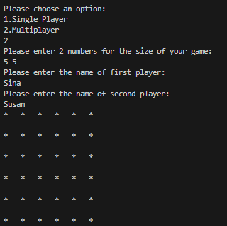
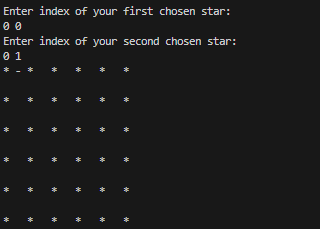
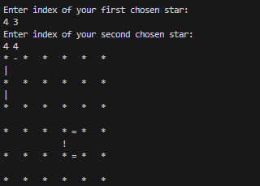
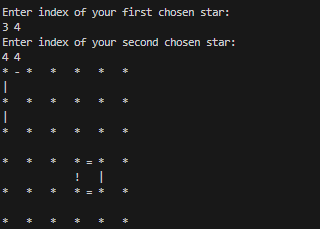
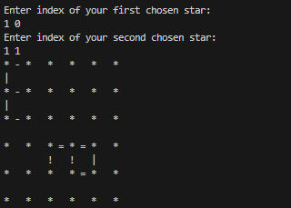
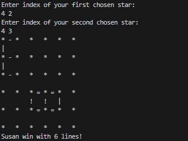

# :white_square_button: Single Box among Dots :white_circle:
**Single Box among Dots** is a terminal-based Java game inspired by the classic Dots and Boxes game. However, in this version, the objective is to be the first player to complete a box. 

## Getting started

This game runs smoothly with OpenJDK version 1.8.0_292.

1. **Clone the repository:** <br />
```
git clone https://github.com/sinaabbasi1/Single-Box-among-Dots.git
```
2. **Compile the project:** If you're using the command line, navigate to the `src/` directory and compile the `.java` files: <br />
```
javac Dots.java
```
3. **Run the game:** <br />
```bash
java Dots
```

## How to Play
1. Run the game from your terminal.
2. Input the desired size of the grid.
3. Enter the name(s) of the player(s).
4. In each round, specify two adjacent points to draw a line between them.
5. The game continues until one player completes the first box using symbols exclusively assigned to them (Player 1: `-` and `|`, Player 2: `!` and `=`).

## Screenshots

|  |  |  |
|:--:|:--:|:--:|
| *a. Initial Game Setup* | *b. First Move* | *c. Player 2's (Susan) Winning Opportunity* |

|  |  |  |
|:--:|:--:|:--:|
| *d. Player 1's Defensive Move* | *e. Player 2's Second Attempt to Win* | *f. Player 2 Wins* |

## Game Rules

- Players take turns adding lines between dots on a grid by choosing the coordinates of two adjacent dots.
- The first player to complete a single box wins the game. All symbols for the completed box must be from the symbols assigned to that player.
- Player 1 choices are shown using the symbols `-` and `|`.
- Player 2 choices are shown using the symbols `!` and `=`.

## Contributing

Feel free to submit issues or pull requests if you find bugs or want to improve the game.

## License

This project is open-source and available under the [MIT License](LICENSE).
